# Crafting interactive narratives for art &amp; design <!-- omit from toc -->

- [1. Module Material](#1-module-material)
- [2. Touchdesigner Basics](#2-touchdesigner-basics)
  - [2.1. Operator Families](#21-operator-families)
  - [2.2. Specific Nodes](#22-specific-nodes)
- [3. MCU - Micro Controller Unit](#3-mcu---micro-controller-unit)
  - [3.1. Possible Sensors](#31-possible-sensors)
  - [3.2. Gyroscope (GY-87)](#32-gyroscope-gy-87)
- [4. Inspiration \& Art Projects](#4-inspiration--art-projects)
  - [4.1. Iconic Interactive Art Projects](#41-iconic-interactive-art-projects)
    - [4.1.1. GENMA (Genetic Manipulator)](#411-genma-genetic-manipulator)
  - [4.2. Films](#42-films)
    - [4.2.1. All that is solid](#421-all-that-is-solid)
    - [4.2.2. The Mess](#422-the-mess)
    - [4.2.3. Hardly Working](#423-hardly-working)
    - [4.2.4. Writing for 5 min](#424-writing-for-5-min)
  - [4.3. Inspiration «Possible Futures?»](#43-inspiration-possible-futures)
    - [4.3.1. Marie-Eve Levasseur, Swiping compressed filtered love (et enfin, permettre l’incontrôlable), 2019, 12 min](#431-marie-eve-levasseur-swiping-compressed-filtered-love-et-enfin-permettre-lincontrôlable-2019-12-min)
      - [4.3.1.1. In what form is the future presented in the example?](#4311-in-what-form-is-the-future-presented-in-the-example)
      - [4.3.1.2. What story is being told, and who is telling it?](#4312-what-story-is-being-told-and-who-is-telling-it)
      - [4.3.1.3. How is the story told? (Medium, mood, other aspects?)](#4313-how-is-the-story-told-medium-mood-other-aspects)
      - [4.3.1.4. What present leads to the depicted future?](#4314-what-present-leads-to-the-depicted-future)
      - [4.3.1.5. What does the artist aim to make visible?](#4315-what-does-the-artist-aim-to-make-visible)
- [5. Group Project](#5-group-project)
  - [5.1. Concept](#51-concept)
    - [5.1.1. Exhaustion](#511-exhaustion)
    - [5.1.2. Early Ideas](#512-early-ideas)
    - [5.1.3. Concept \& Story](#513-concept--story)
  - [5.2. Prototyping](#52-prototyping)
    - [5.2.1. Inspiration / Idea](#521-inspiration--idea)
    - [5.2.2. Research](#522-research)
    - [5.2.3. First Touch Detection](#523-first-touch-detection)
    - [5.2.4. Materials \& Interaction](#524-materials--interaction)
      - [5.2.4.1. Crystals](#5241-crystals)
    - [5.2.5. Multi Touch Sensor](#525-multi-touch-sensor)
    - [5.2.6. TouchDesinger](#526-touchdesinger)
      - [5.2.6.1. Voronoi](#5261-voronoi)
      - [5.2.6.2. Ice](#5262-ice)
    - [5.2.7. Installation](#527-installation)
    - [5.2.8. Beamer Setup](#528-beamer-setup)
  - [5.3. Production](#53-production)
    - [5.3.1. Wooden Branch](#531-wooden-branch)
    - [5.3.2. Hardware](#532-hardware)
    - [5.3.3. Visuals](#533-visuals)
    - [5.3.4. Interaction](#534-interaction)
      - [5.3.4.1. Visual Effect](#5341-visual-effect)
      - [5.3.4.2. Touch Indicator](#5342-touch-indicator)
    - [5.3.5. Audio](#535-audio)
    - [5.3.6. Text description](#536-text-description)
    - [5.3.7. Final Setup](#537-final-setup)
    - [5.3.8. Final Program Files](#538-final-program-files)
  - [5.4. Item List](#54-item-list)
  - [5.5. Presentation](#55-presentation)
  - [5.6. Reflection](#56-reflection)

# 1. Module Material
- [Github Module](https://github.com/gu-ma/co_128_f2501/tree/main)
- [Github Pages Module](https://gu-ma.github.io/co_128_f2501/)
- [Github Pages Toolbox TouchDesigner](https://digitalideation.github.io/toolbox-touchdesigner/)
- [Miro Board Organisation](https://miro.com/app/board/uXjVLsCBg4A=/)

# 2. Touchdesigner Basics
[Official Lerning Page](https://learn.derivative.ca/courses/100-fundamentals/)

[Touchdesigner Wiki](https://docs.derivative.ca/)

## 2.1. Operator Families
- [Components (COMPs)](https://docs.derivative.ca/Component)
- [Texture Operators (TOPs)](https://docs.derivative.ca/TOP)
- [Channel Operators (CHOPs)](https://docs.derivative.ca/CHOP)
- [Surface Operators (SOPs)](https://docs.derivative.ca/SOP)
- [Materials (MATs)](https://docs.derivative.ca/MAT)
- [Data Operators (DATs)](https://docs.derivative.ca/DAT)


&copy; [https://docs.derivative.ca/OP_Create_Dialog](https://docs.derivative.ca/OP_Create_Dialog)

## 2.2. Specific Nodes
- Traill: Visualize nubers over time
- Filter: Smooth out change of values
- Lag: Smooth uneven, ease in
- Spring: spring on value changes
- Fan: Snap to defined number of values

# 3. MCU - Micro Controller Unit

## 3.1. Possible Sensors

| Sensor Type                   | Short Explanation         |
| ----------------------------- | ------------------------- |
| Temperature Sensor            | Measures heat/cold        |
| Pressure Sensor               | Detects force/pressure    |
| Proximity Sensor              | Senses nearby objects     |
| Accelerometer                 | Measures acceleration     |
| Gyroscope                     | Detects rotation          |
| IR (Infrared) Sensor          | Senses infrared light     |
| Light/Optical Sensor          | Measures light intensity  |
| Ultrasonic Sensor             | Uses sound for distance   |
| Flow Sensor                   | Measures fluid movement   |
| Level Sensor                  | Detects fluid level       |
| Smoke/Gas Sensor              | Detects gases/smoke       |
| Microphone (Sound Sensor)     | Captures sound            |
| Touch Sensor                  | Detects physical touch    |
| Color Sensor                  | Identifies color          |
| Humidity Sensor               | Measures air moisture     |
| Magnetic (Hall Effect) Sensor | Detects magnetic fields   |
| Position Sensor               | Tracks object position    |
| Tilt Sensor                   | Detects angle/tilt        |
| PIR Sensor                    | Detects body motion       |
| Strain/Weight Sensor          | Measures load/strain      |
| Piezoelectric Sensor          | Senses vibrations         |
| Camera Sensor                 | Captures images           |
| Vibration Sensor              | Detects vibrations        |
| Lidar Sensor                  | Measures distance (laser) |
| Barometric Sensor             | Measures air pressure     |
| Angle Sensor                  | Measures angle            |
| Capacitive Sensor             | Detects capacitance       |
| Inductive Sensor              | Senses metal objects      |
| Chemical Sensor               | Detects chemicals         |
| Environmental Sensor          | Monitors environment      |

## 3.2. Gyroscope (GY-87)
[Running the gyroscope on an Arduino Uno](https://electropeak.com/learn/interfacing-gy-87-10dof-imu-mpu6050-hmc5883l-bmp085-module-with-arduino/)

- Connect your Arduino to your computer via USB.  
- In TouchDesigner, add a **Serial DAT** node.  
- Set the **Port** in Serial DAT to match your Arduino’s COM port (you can find it in the Arduino IDE under *Tools > Port*).  
- Set the **Baud Rate** in Serial DAT to match your Arduino code (e.g., 9600).  
- The Serial DAT will now display the data sent from Arduino’s `Serial.print()` or `Serial.println()` commands in real time.

The provided code writes the sensor information to the "Serial Output". This can be read in TouchDesigner.  

**The Arduino can only be connected to one Software! So the Arduino can't keep the connection with the Arduino IDE**

# 4. Inspiration & Art Projects

## 4.1. Iconic Interactive Art Projects

[List with all Projects](https://gu-ma.github.io/co_128_f2501/notes/week02_day03.html)

### 4.1.1. GENMA (Genetic Manipulator)
- **Artists:** Christa Sommerer and Laurent Mignonneau
- **Overview:** An interactive installation where visitors can create and influence virtual creatures by sending messages.
- **Website:** [https://interface.ufg.ac.at/christa-laurent/GENMA.html](https://interface.ufg.ac.at/christa-laurent/GENMA.html)

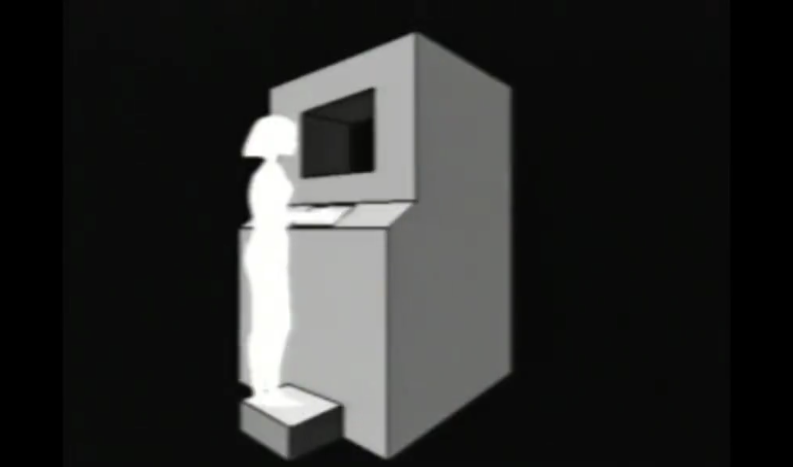
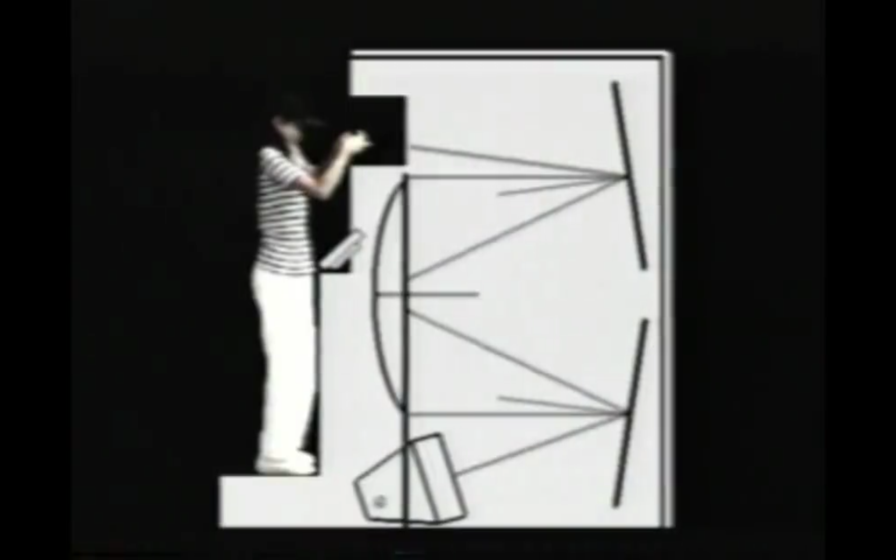
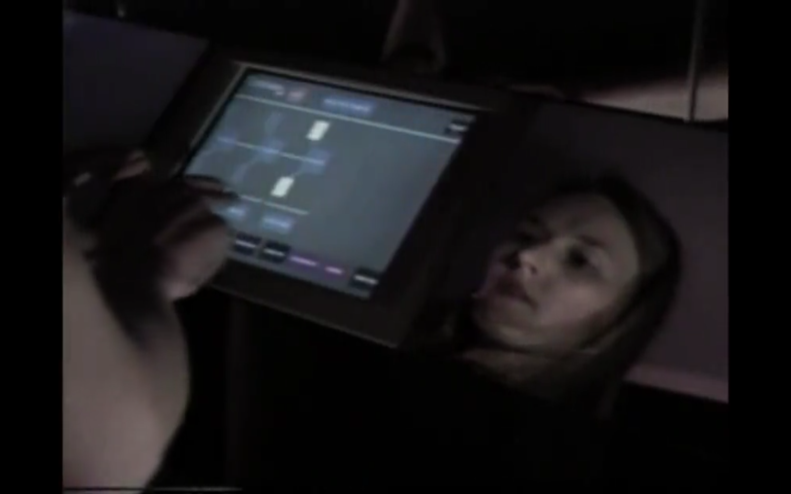

&copy; [(https://interface.ufg.ac.at/christa-laurent/GENMA.html](https://interface.ufg.ac.at/christa-laurent/GENMA.html)


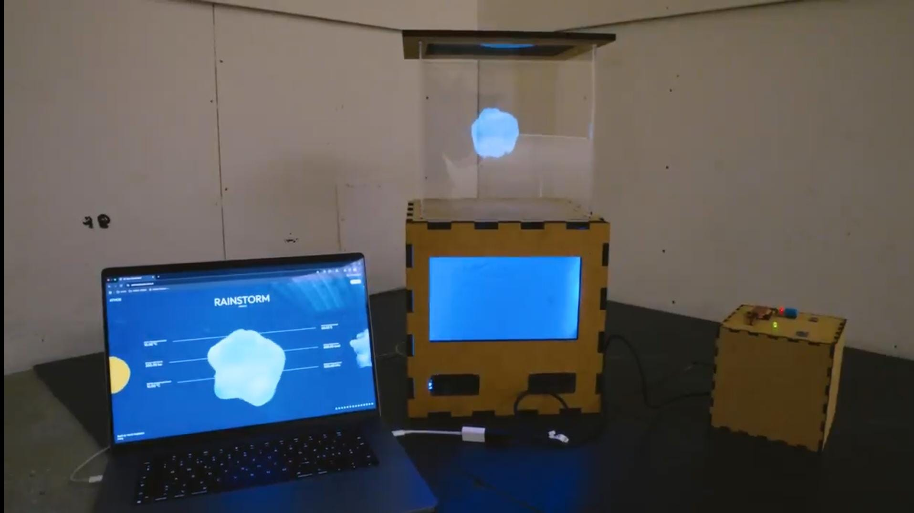
&copy; [Yanis Deplazes - LinkedIn](https://www.linkedin.com/posts/yanis-deplazes_turning-weather-data-into-an-immersive-experience-activity-7317160431339372544-nTXG?utm_source=share&utm_medium=member_desktop&rcm=ACoAADNrVocBVKcO5P9hOsECXsq_EsBUEghWFIY) / 
[https://atmos.yanis.io/](https://atmos.yanis.io/) / 
[Github](https://github.com/YanisDeplazes/atmos)

## 4.2. Films

### 4.2.1. All that is solid
- Gold in Ghana

### 4.2.2. The Mess
- Noise
- Futuristic story told in the past

### 4.2.3. Hardly Working
- npc's in Red dead redemtion 2

### 4.2.4. Writing for 5 min
Erschöpfng ist keine energie mehr zu habne. keine Motivation. Viel Arbeit, keine Abwechsung. Ich bin erschöpft wenn ich keine Pausen habe. Wenn ich oft das gleiche mache ohne etwas daran zu ändern. Abwechslung ist wichtig um nicht erschöpft zu werden. bei allen Tätigkeiten werde ich erschöpft. es ist eine Balance zwischen erschöpfung und energie / recharge. es ist wichtig sich stetig zu erholen. machmal habe ich diese balance mehr im griff als zu anderen zeiten. Ich sollte mehr au diese banance achten. Es gibt viele Spakte welche mich erschöpfen lassen. meine eigene Energie oder sozial. Diese verschiedenen Energien im blick zu halten ist ebenfalls erschöpfend. Die Erholung ist dabei wichtig. Beim Arbeiten ist der Flow state für mich wichtig um nicht erschöpft zu werden. Der eigene Antrieb. intridische motivation. Externer zwang bringt mich aus dem gleichgewicht. ich bin nicht motiviert. das erschöpft mich. ich brache danach viel Zeit um micht wieder zu erholen.

## 4.3. Inspiration «Possible Futures?»

Questions:
- In what form is the future presented in the example?
- What story is being told, and who is telling it?
- How is the story told? (Medium, mood, other aspects?)
- What present leads to the depicted future?
- What does the artist aim to make visible?

Artwork List:

- **Hito Steyerl, This is the Future, 2019, 3-4 min.**
This Is the Future is a multimedia installation that blends video, sound, and artificial intelligence to explore themes of prediction, control, and the politics of technology. Set in a lush, digitally rendered garden, the work centers on a narrative about a woman whose future is continuously predicted by an AI system—yet the system keeps getting it wrong. [https://www.youtube.com/watch?v=WyIWLvyzcH4](https://www.youtube.com/watch?v=WyIWLvyzcH4) / 
[https://www.youtube.com/watch?v=1v08U5-BKnE](https://www.youtube.com/watch?v=1v08U5-BKnE)
 
- **John Akomfrah, The Last Angel of History, 1996, 45 min.**
The Last Angel of History (1996) is a groundbreaking experimental documentary directed by John Akomfrah and produced by the Black Audio Film Collective. Blending science fiction, archival footage, interviews, and Afrofuturist aesthetics, the film explores the intersections of Black identity, diaspora, technology, and cultural memory.It follows a fictional "Data Thief" who travels through time and space to uncover hidden histories of Black culture and its relationship to the future. Featuring figures like George Clinton, Sun Ra, and Kodwo Eshun, the film situates Black experience within a cosmic framework, redefining narratives of science, technology, and progress through an Afrofuturist lens. 
[https://www.youtube.com/watch?v=gcbSUwPjass](https://www.youtube.com/watch?v=gcbSUwPjass)
 
- **Black Code/Code Noir, Louis Henderson, 2015, 20 min.**
Black Code/Code Noir unites temporally and geographically disparate elements into a critical reflection on two recent events: the murder of Michael Brown and that of Kajieme Powell by American police officers in 2014. Archaeologically, the film argues that behind this current situation is a sedimented history of slavery, preserved by the Black Code laws of the colonies in the early Americas. These codes have transformed into the algorithms that configure police Big Data and the necropolitical control of African-Americans today. Yet, how can we read this in the present? How can we unwrite the sorcery of this code as a hack? Through a historical détournement, the film suggests the Haitian Revolution as the first instance of a hacking of the Black Code and, perhaps, a symbol for future hope. 
[https://www.dropbox.com/scl/fi/nidiur49siwf30msl27zf/11_henderson_black-code.mov?rlkey=ygm4ltt4n3da3we14lmelszej&st=1kvc033s&dl=0](https://www.dropbox.com/scl/fi/nidiur49siwf30msl27zf/11_henderson_black-code.mov?rlkey=ygm4ltt4n3da3we14lmelszej&st=1kvc033s&dl=0)

- **Marie-Eve Levasseur, Swiping compressed filtered love (et enfin, permettre l’incontrôlable), 2019, 12 min.**
This work imagines a future where online seduction can be optimized by slow-tech devices that simulate hormonal emissions. The chemical messages that our bodies send to each other could be perceived by another from a distance, adding an uncontrolled dimension to the filtered flirtation. The work reflects on online dating mechanisms like dependency, consumerism, objectification and reduction of the body to calculable parameters, as well as our need for intimacy. [https://exhibition.fabulationforfuture.net/swiping-compressed-filtered-love-et-enfin-permettre-lincontrolable-2/ ](https://exhibition.fabulationforfuture.net/swiping-compressed-filtered-love-et-enfin-permettre-lincontrolable-2/)
 
- **Emeka Ogboh, The Way earthly things are going, 2017, 9 min.**
Ogboh explores how private, public, and collective memories and historiographies are translated, transformed, transcribed, and engraved in sound and sonority. Such is the case when he rummages through the archives for documents about financial crises from 1929 to the present day. In The Way Earthy Things Are Going (2017), Ogboh, in dialogue with a traditional polyphonic choir, deliberates sonically on the multiple effects and manifestations of states of crisis. The enchanting sound installation addresses the (im-)possibility of existing in a cul-de-sac; it tells of wanderlust and yearning, of pain and a survival urge, and it features comments on and impressions of an economic crisis that has plagued and is still ravaging. In interviews with Africans in Germany, Ogboh tickled the taste buds to map a landscape of sonority. By collating their gustatory experiences, he created a recipe from which the dark Sufferhead original (2016) is brewed. The name is taken from Fela Kuti’s political hymn, which Ogboh uses to catalyze discourse on the politics of race, concepts of nation, and migration. 
[https://www.youtube.com/watch?v=rWIjPsS0oq4](https://www.youtube.com/watch?v=rWIjPsS0oq4)
 
- **Wu Tsang, Of Whales, 2022, 11 min.**
Of Whales, an immersive real-time video installation that offers a poetic meditation on the whale’s perspective, through a deep dive into an oceanic cosmos that is alluded to in Herman Melville’s tale. First presented at the 59th Venice Biennale in 2022, the work was created on the Unity gaming platform as a dynamically generated real-time video and sound installation, which envelops visitors in an oceanscape-cosmos for respite, contemplation, and provocation. 
Of Whales refocuses the source material’s profound meditation on knowledge, exoticism, and eroticism through a postcolonial lens, imagined from the perspective of the whale. The immensity of the ocean becomes a symbol of the unknown; reflections gesture to the presence of oblique perspectives and complexify the idea that any point of view is singular or straightforward. 
[https://www.youtube.com/watch?v=pCmbQMpnDDU](https://www.youtube.com/watch?v=pCmbQMpnDDU)

### 4.3.1. Marie-Eve Levasseur, Swiping compressed filtered love (et enfin, permettre l’incontrôlable), 2019, 12 min

#### 4.3.1.1. In what form is the future presented in the example?

The future is presented in a speculative and poetic form. It's not a technical or utopian future, but rather an artistic and **critical projection of current trends** in online dating and technology. This imagined future involves "slow-tech" devices that allow **hormonal emissions to be transmitted and perceived over distance-creating a hybrid between biological intimacy and digital interaction**.

-> Software and Device

#### 4.3.1.2. What story is being told, and who is telling it?

The story reflects an imagined evolution of dating technologies, where human pheromones and emotional signals are digitally translated and transmitted. It critiques how dating has become algorithmic, filtered, and consumer-like. 

The narrator (possibly a voice-over or digital persona) presents the story from a reflective and somewhat speculative point of view—offering observations rather than a linear narrative. The storyteller could be interpreted as a future entity or consciousness looking back at present-day behavior.

#### 4.3.1.3. How is the story told? (Medium, mood, other aspects?)

- Medium: Video art (12 minutes), combining visual collage, digital aesthetics, voice-over narration, and possibly synthetic imagery or simulations of tech devices.
- Mood: Reflective, critical, and slightly melancholic. There is a sense of irony and emotional distance, yet also curiosity and vulnerability.
- Other aspects: The video blends technological concepts with bodily and emotional metaphors. It creates a sensory and conceptual experience that critiques present-day dating culture by amplifying it into a strange, speculative direction.

-> Video -> office, physical device, phone, screenrecording

#### 4.3.1.4. What present leads to the depicted future?

The present depicted is dominated by:
- Swipe-based dating apps (like Tinder) and the gamification of romantic connection.
- The commodification of intimacy, where people become profiles and data points.
- Increasing emotional distance despite technological connectivity.
- A desire to "optimize" or control love and desire.
This hyper-technologized and emotionally filtered present gives rise to the imagined future where hormonal signals are transmitted digitally to reintroduce uncontrollable, emotional complexity into digital interactions.

#### 4.3.1.5. What does the artist aim to make visible?

Marie-Eve Levasseur wants to make visible:

- The mechanisms of online dating (dependency, consumerism, objectification).
- The loss of organic, unfiltered bodily communication in digital relationships.
- The paradox of trying to control intimacy while yearning for unpredictability.
- The potential alienation of the body, reduced to quantifiable data in virtual spaces.

Ultimately, she encourages reflection on what is lost and what might be reimagined if we allowed the uncontrollable, emotional, and bodily dimensions of love back into our digital lives.

# 5. Group Project

## 5.1. Concept

### 5.1.1. Exhaustion
As a class, we explored the topic of exhaustion—its content and what aspects interested us most. Based on a shared interest in recovery, sleep, and rest, Lucas, Katerina, Nika, and I formed a group.

### 5.1.2. Early Ideas
In our group of four, we each considered different ideas and aspects. We knew we would need to split up, so we discussed our interests in more detail. Two groups formed: Lucas and Katerina, and Nika and me. While Lucas and Katerina were more interested in the state of lying down, rest, and sleep, Nika and I focused on working together and caring for an entity, perhaps with an element of play.

We then developed our concept around the narrative of working together to resist exhaustion. As a working claim, we called it "Together resisting exhaustion." We wanted an installation that would bring strangers together to work toward a shared goal. When visiting, it should be clear that one person alone cannot achieve the goal, or at least it would be very difficult. This should encourage people to ask for help and come together.

Our initial concept featured a plant as the main entity around which the interaction was set up. We liked the idea of people acting as energy sources, transferring their energy to the entity. People would touch the plant, and as more people participated, the plant would come to life.

Later, Joya joined our group and was interested in creating a physical interaction. We rethought our interaction point and adapted our concept and visualisation, while keeping the main narrative of bringing people together to achieve a higher goal as a group rather than alone.

### 5.1.3. Concept & Story
We gave the project the name "icebreaker", because the visuals start with ice and the installation brings starangers together. 

There is a small notice next to the installation in case people are too afraid to interact with the project.

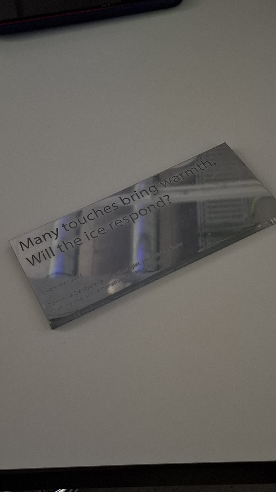

Several conductive threads hang from a tree branch. These interact with the visual when touched. While it takes several people touching the threads for the visual to fully bloom, there are also in-between states to show that something is happening.

The idea is to represent the topic of "exhaustion" through the visuals. It starts with ice. The more people touch the threads, the more the visual begins to "crack," bubble, and warm up. If all the threads are touched, the visual reaches its peak.

The concept of the project is "together resisting exhaustion." Collaboration happens at the threads. The goal is to bring people together and, by doing so, share and reduce some exhaustion from an abstract entity, as everyone takes a little part of it (by holding a thread). The focus is on actively participating (rather than being consumed by exhaustion) and caring for each other.

## 5.2. Prototyping

### 5.2.1. Inspiration / Idea
Lucas, a classmate, once mentioned that it’s possible to measure the static electricity a human has. This inspired me to search for a solution using one-wire touch detection. I imagined it somewhat like a 3-pin sensor: two wires form the connection, and the third controls the amount of electricity. So, when you touch it, it functions like a [potentiometer](https://www.google.com/search?q=Potentiometer).

Joya and Thomas mentioned that it would be easy to use two wires to detect a connection. While that would be a workable fix, it doesn’t serve the purpose as well as a single wire.

I imagined connecting around 50 wires to this single one, so that all of them detect touch, and the intensity of touch adds up. This would suitably represent our idea of multiple people working together.

### 5.2.2. Research
Before we tried to find the right words to Google my idea, I explained my vision to [Perplexity](https://www.perplexity.ai/) and asked for ideas and keywords to google. In addition to that, Perplexity gave me two different approaches. After some discussion and researching the functionality, I decided to try one of Perplexity's suggestions.

[Chat with Perplexity](https://www.perplexity.ai/search/i-have-an-arduino-uno-i-want-t-TmeZzg8hTVuNVF7Y_H6DYw#0)

### 5.2.3. First Touch Detection
For the whiring I looked up some references.

``` md
[Arduino Uno]
|                      |
D4 (Send) ----- R1MΩ ----- D2 (Receive)  
                       |  
                       └──[Touch Wire]
```
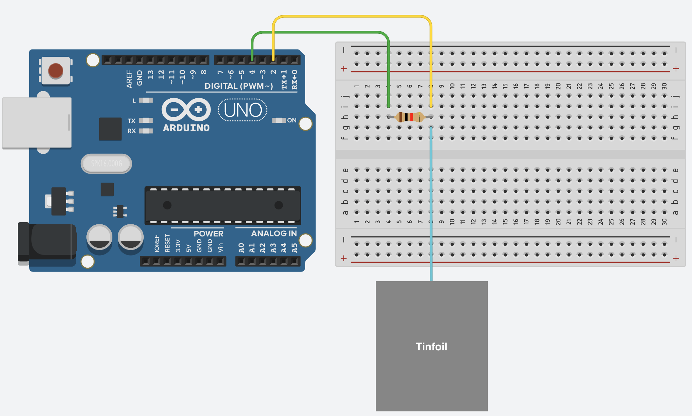

We got the Arduino and wired it as shown in the reference. The only problem was that we had only one resistor, and we couldn’t read the colour code on it.

After wiring, we copied the code into a new Arduino sketch and uploaded it to the Arduino. The [included library for the capacitive sensor was downloaded from GitHub](https://github.com/PaulStoffregen/CapacitiveSensor).


``` C++
#include <CapacitiveSensor.h>

// Create a capacitive sensor object with send pin 4 and receive pin 2
CapacitiveSensor cs_4_2 = CapacitiveSensor(4, 2);

void setup() {
  Serial.begin(9600); // Start serial communication for output
  cs_4_2.set_CS_AutocaL_Millis(0xFFFFFFFF); // Disable auto-calibration for stable readings
}

void loop() {
  long sensorValue = cs_4_2.capacitiveSensor(30); // Take 30 samples for stability
  Serial.println(sensorValue); // Print the sensor value to the Serial Monitor
  //Serial.println("test");
  delay(1000); // Small delay to make output readable
}
```

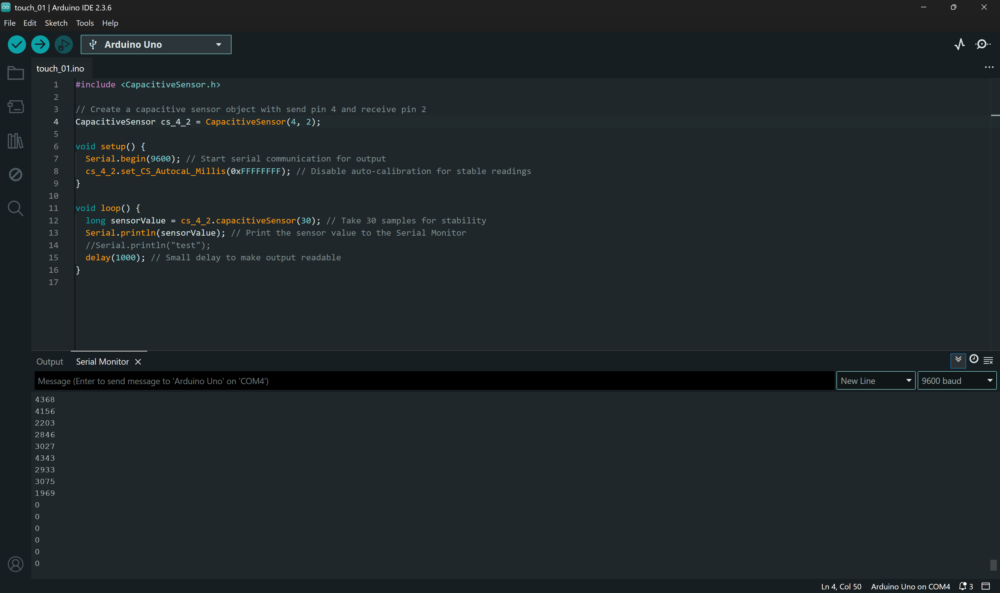

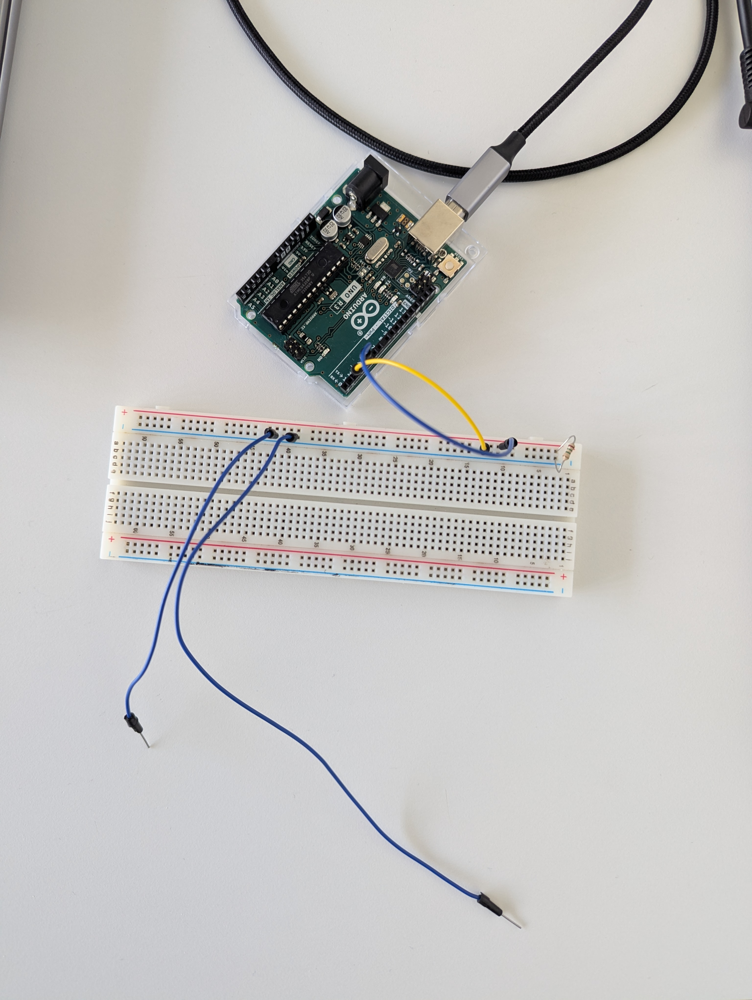

At first, we were only getting values of "0". Perplexity suggested that the resistor was probably too low — the higher the resistance, the better. Of course, there could have been other issues, since it was an AI-generated setup and code, but we knew the resistor was very likely unsuitable.

To increase the static electricity, we tried touching the metal part of the table. Surprisingly, it worked! We weren’t expecting that, but now we knew the setup works in principle. We then experimented with different resistors and found one that gave us high values when touched. An online calculator estimated it to be around 2.5 MΩ.

<video controls width="600">
  <source src="img/arduino_touch_03.mp4" type="video/mp4">
</video>

### 5.2.4. Materials & Interaction
The next step was testing the setup with different threads and fabrics.

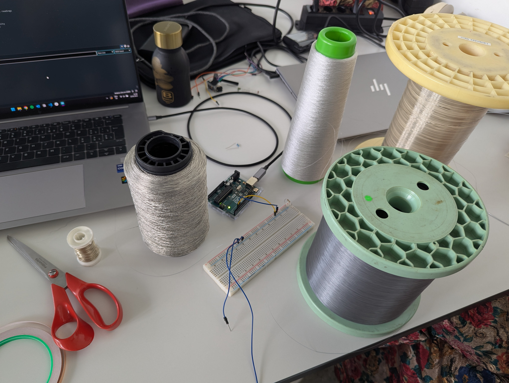
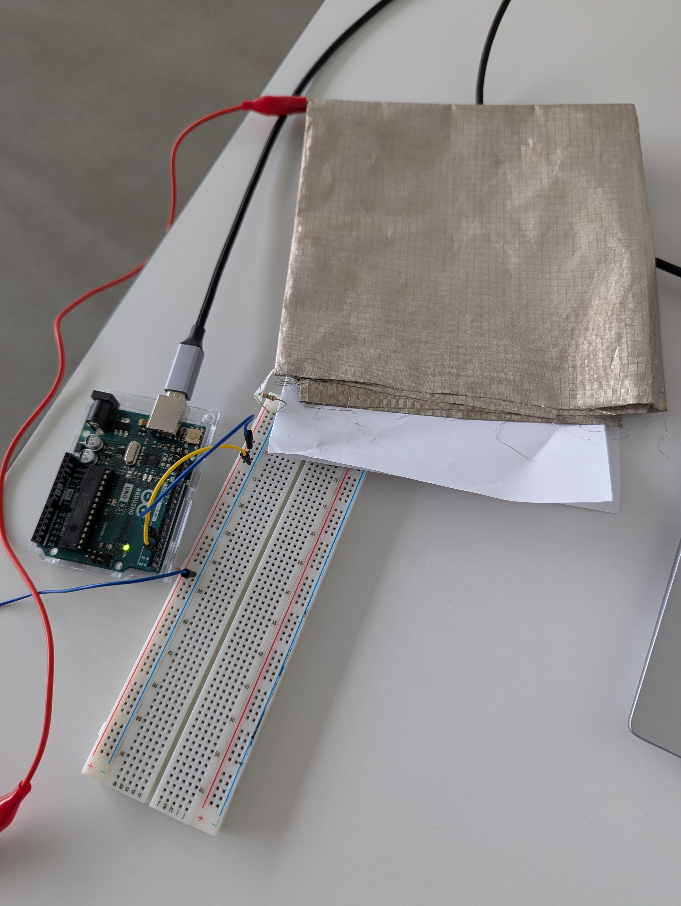

You probably can’t see it, but here we hung some different threads and wires and connected them all together to the Arduino.


No matter how many or which ones you touch, it reads the amount of electricity touching the wires. It was difficult to set up a stable connection for every single thread, so sometimes we got stable and reliable results, and other times we didn’t.

#### 5.2.4.1. Crystals
As we thought about water and ice, transparent crystals came to mind as a visualisation of ice. So, we tried growing crystals on a wooden branch.

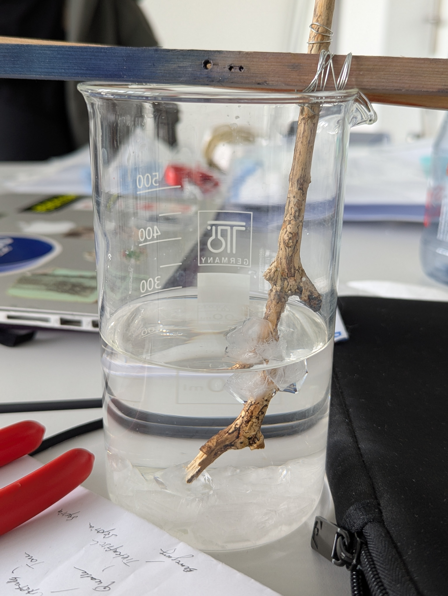

This worked well. However, due to the ratio being slightly off, the crystals grew too large. We would have preferred smaller crystals.

Later, we also considered that the interaction point needs to be inviting to touch. Crystals look nice, and people might want to give them a gentle touch, but not a firm grip—which wouldn’t be ideal for our installation.

### 5.2.5. Multi Touch Sensor
We wanted to try a different sensor, one that can read multiple touches at the same time. The downside is that the output data is binary: 0 or 1, meaning touch or no touch. First, we had to solder the connectors to the sensor.

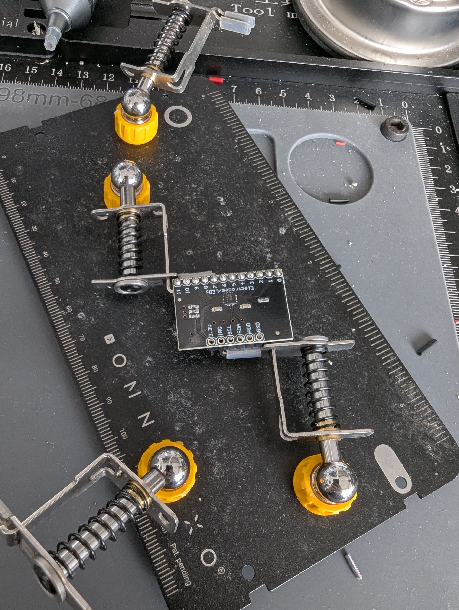

For the connection, we first used the wiring from [this Website](https://learn.sparkfun.com/tutorials/mpr121-hookup-guide/all).

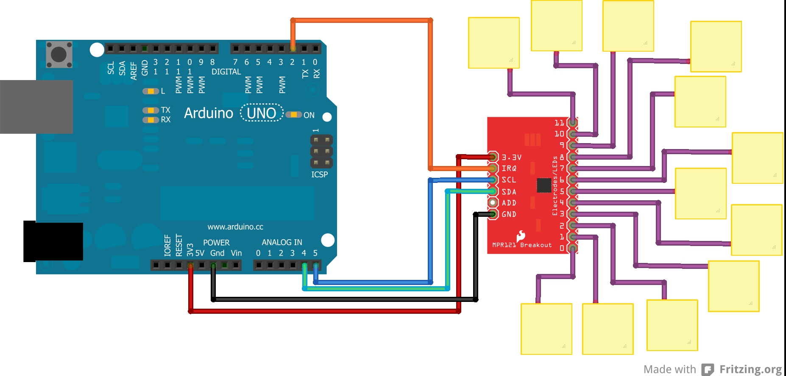

Since the library didn’t work properly, we switched to the [library from adafruit](https://learn.adafruit.com/adafruit-mpr121-12-key-capacitive-touch-sensor-breakout-tutorial/wiring) included in the Arduino IDE.

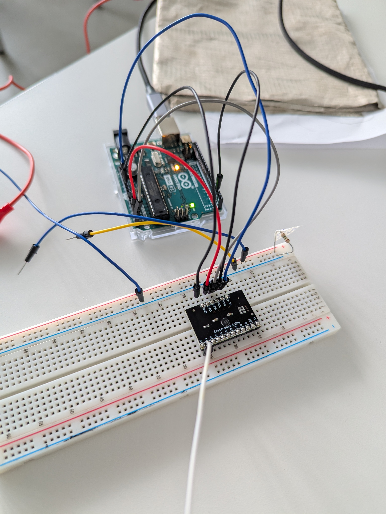

There was a major problem using the sensor: pins 2 and 10 were constantly being read as touched. In addition to losing those two pins, pins 4 to 11 (except for pin 10) did not respond at all. Only pins 0, 1, and 3 worked properly.

We tested the example code from the library.

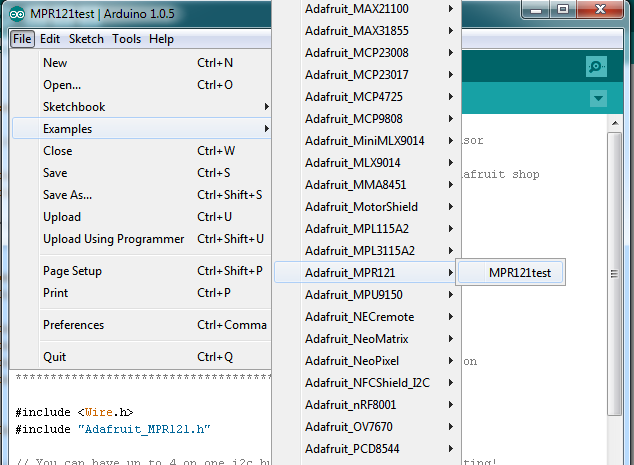

``` C++
#include <Wire.h>
#include "Adafruit_MPR121.h"

#ifndef _BV
#define _BV(bit) (1 << (bit)) 
#endif

// You can have up to 4 on one i2c bus but one is enough for testing!
Adafruit_MPR121 cap = Adafruit_MPR121();

// Keeps track of the last pins touched
// so we know when buttons are 'released'
uint16_t lasttouched = 0;
uint16_t currtouched = 0;

void setup() {
  Serial.begin(9600);

  while (!Serial) { // needed to keep leonardo/micro from starting too fast!
    delay(10);
  }
  
  Serial.println("Adafruit MPR121 Capacitive Touch sensor test"); 
  
  // Default address is 0x5A, if tied to 3.3V its 0x5B
  // If tied to SDA its 0x5C and if SCL then 0x5D
  if (!cap.begin(0x5A)) {
    Serial.println("MPR121 not found, check wiring?");
    while (1);
  }
  Serial.println("MPR121 found!");
}

void loop() {
  // Get the currently touched pads
  currtouched = cap.touched();
  
  for (uint8_t i=0; i<12; i++) {
    // it if *is* touched and *wasnt* touched before, alert!
    if ((currtouched & _BV(i)) && !(lasttouched & _BV(i)) ) {
      Serial.print(i); Serial.println(" touched");
    }
    // if it *was* touched and now *isnt*, alert!
    if (!(currtouched & _BV(i)) && (lasttouched & _BV(i)) ) {
      Serial.print(i); Serial.println(" released");
    }
  }

  // reset our state
  lasttouched = currtouched;

  // comment out this line for detailed data from the sensor!
  return;
  
  // debugging info, what
  Serial.print("\t\t\t\t\t\t\t\t\t\t\t\t\t 0x"); Serial.println(cap.touched(), HEX);
  Serial.print("Filt: ");
  for (uint8_t i=0; i<12; i++) {
    Serial.print(cap.filteredData(i)); Serial.print("\t");
  }
  Serial.println();
  Serial.print("Base: ");
  for (uint8_t i=0; i<12; i++) {
    Serial.print(cap.baselineData(i)); Serial.print("\t");
  }
  Serial.println();
  
  // put a delay so it isn't overwhelming
  delay(100);
}
```

Further, we tested the code provided from Perplexity. (It linked following websites as used sources: [Website 1](https://38-3d.co.uk/de/blogs/blog/so-verwenden-sie-den-kapazitiven-touch-sensor-mpr121-mit-arduino) / [Website 2](https://www.circuits-diy.com/interfacing-mpr121-capacitive-touch-sensor-module-with-arduino/))

``` C++
#include <Wire.h>
#include "Adafruit_MPR121.h"

Adafruit_MPR121 cap = Adafruit_MPR121();

void setup() {
  Serial.begin(9600);
  while (!Serial) delay(10); // For Leonardo/Micro

  Serial.println("Adafruit MPR121 Capacitive Touch sensor test");

  if (!cap.begin(0x5A)) {
    Serial.println("MPR121 not found, check wiring?");
    while (1);
  }
  Serial.println("MPR121 found!");
}

void loop() {
  uint16_t currtouched = cap.touched();
  for (uint8_t i = 0; i < 12; i++) {
    if (currtouched & (1 << i)) {
      Serial.print(i); Serial.println(" touched");
    }
  }
  delay(100);
}
```

### 5.2.6. TouchDesinger
The Arduino writes the detected values to the serial output. This can be read in TouchDesigner using the **Serial DAT** operator. The input needs to be converted into numbers and rescaled to be used properly. In the example, the numbers are divided by 1000 to produce smaller values and then offset to ensure values remain above 1. The touch input is used to modify a noise texture.

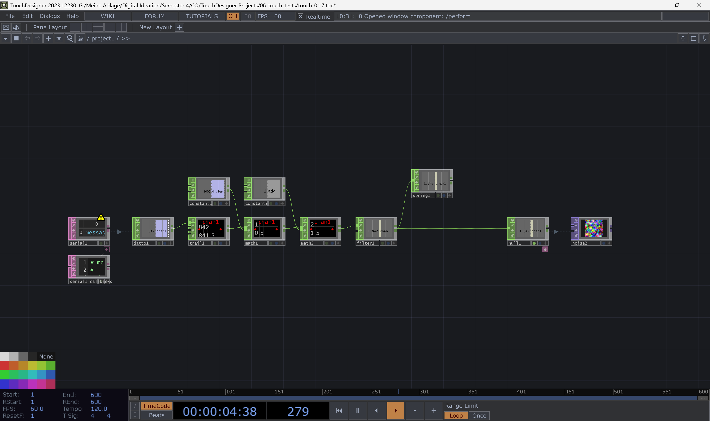

#### 5.2.6.1. Voronoi
To create a basic water drop visual, you can simply add a Voronoi texture and tweak the settings. TouchDesigner doesn’t include a Voronoi texture by default, so we tried to imitate this effect.

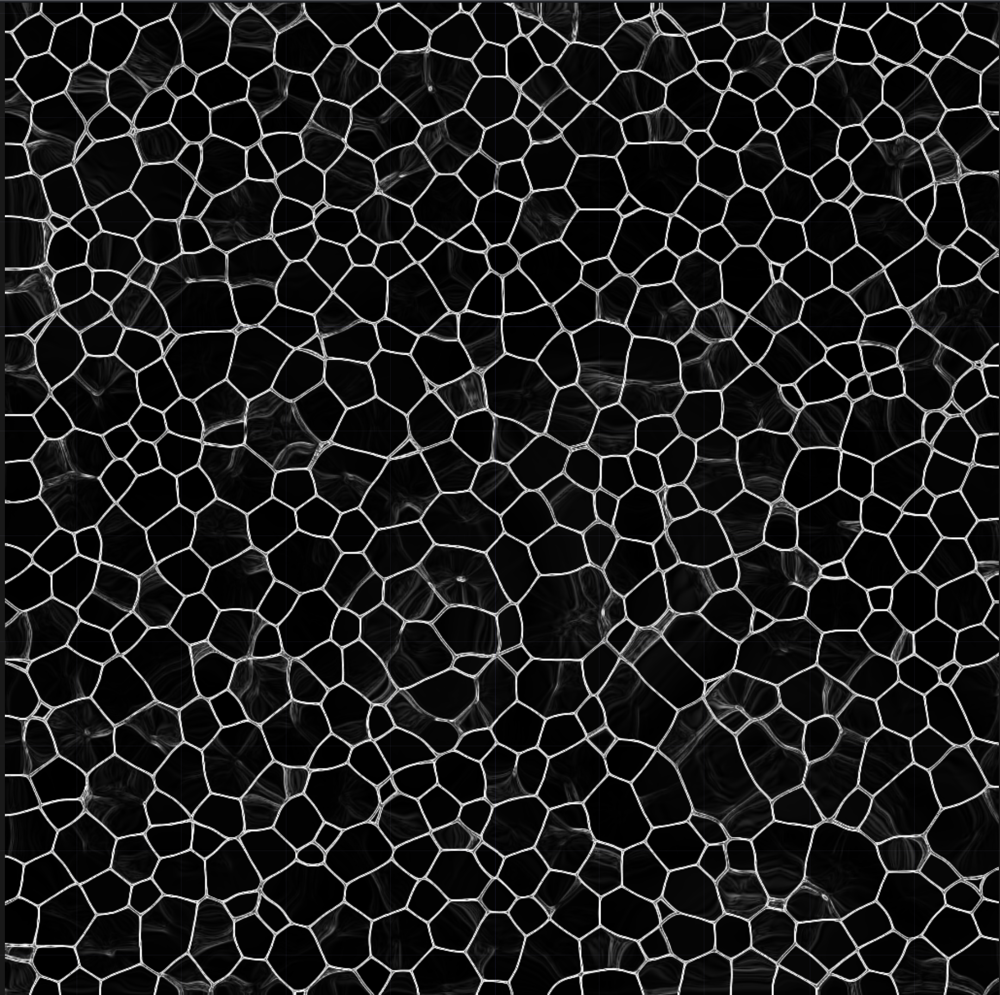

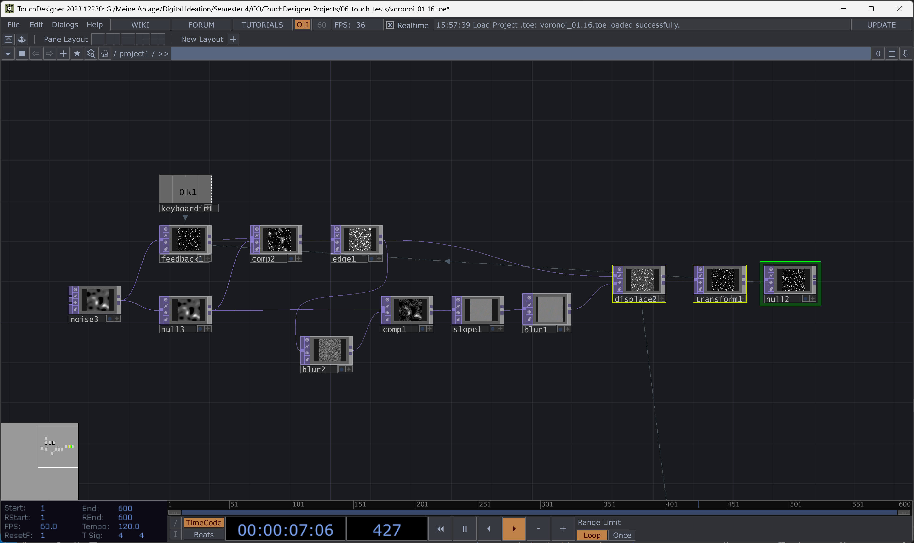

This Voronoi setup is based on noise and feedback. The main issue is that it’s almost impossible to control the movement, especially the speed. While it creates a nice visual, it is not very adaptable.

#### 5.2.6.2. Ice
We wanted water as the main entity, with the visual changing based on parameters from the Arduino. Initially, we imagined it being icy, then gradually transitioning to a more liquid state, perhaps with some bubbles added later.

First, we started with the more static, icy-like part. It’s a network with edges and feedback loops.

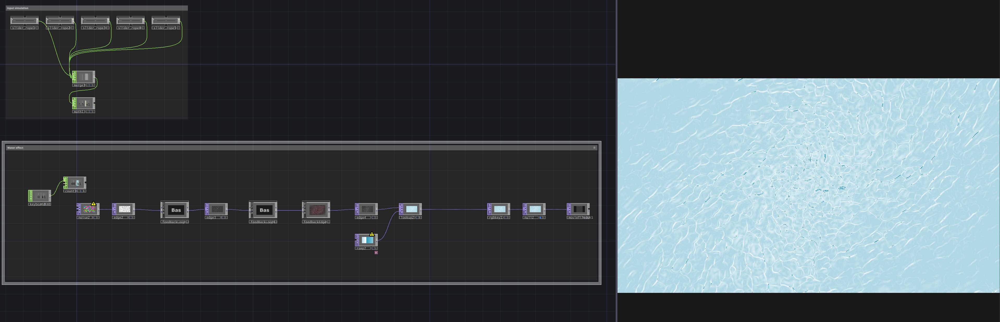
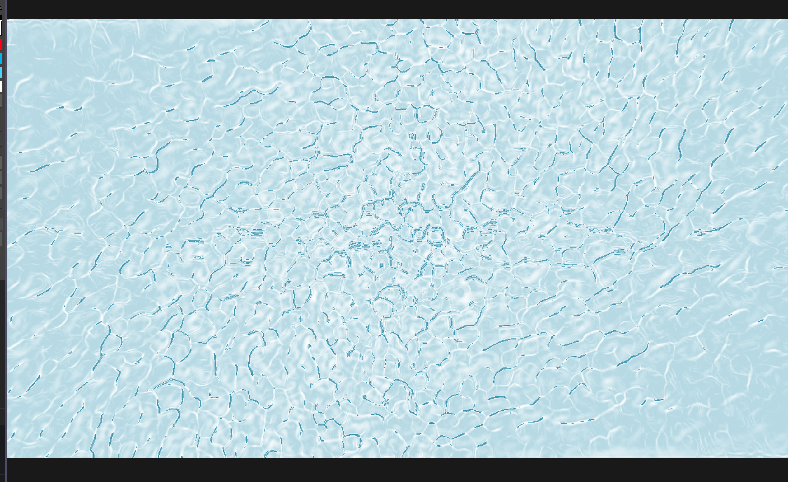

We thought it could be a possibility to just subtract the effects for our project and leave the background blank or in a single color so the Arduino input would have an easier time.

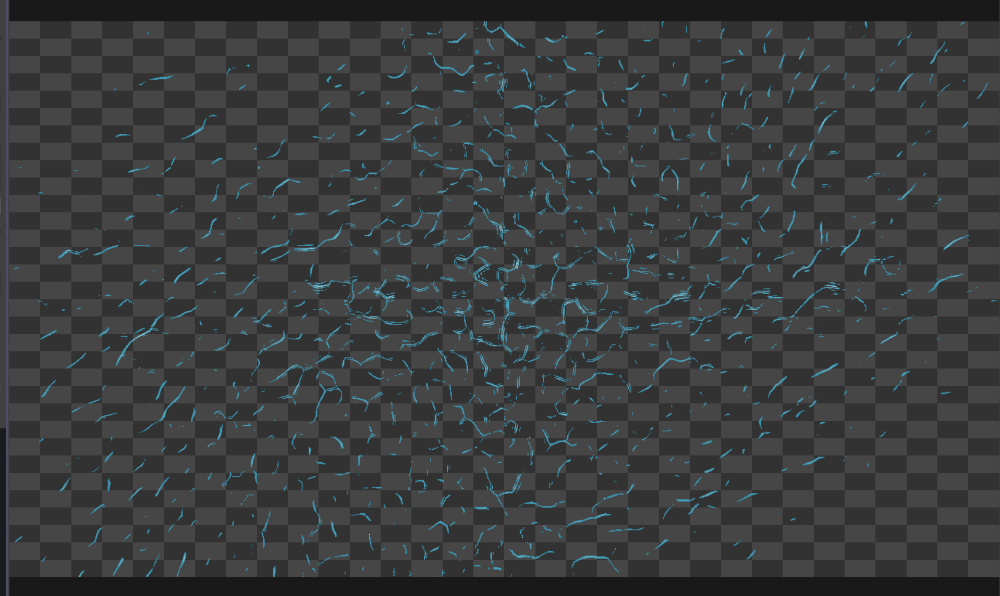

Then we created another network, which was similar but designed for the water visual.

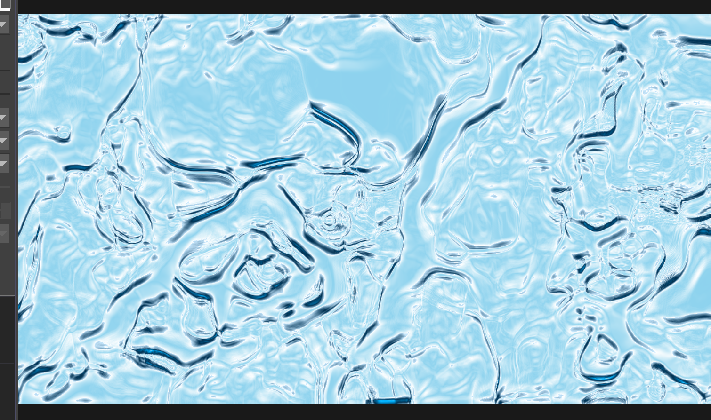

We then realized it would make more sense to use the same network and let the Arduino tweak some parameters. So, we based it on the water and ice visuals again but adjusted the parameters while keeping the structure the same.

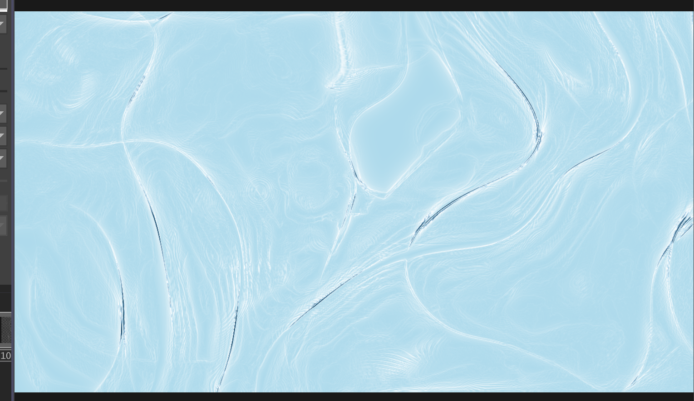

We needed another state of the visual to represent the final stage. It's the same network, but with added RGB and bloom to enhance the effect, increased speed, and a deeper blue color. Also, we added another feedback loop to make it more dynamic and bubbly.

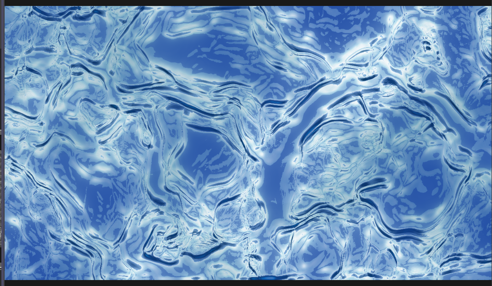

Finally, we created a final state that would be shown when all the wires are touched.

### 5.2.7. Installation

To test the installation and interaction we connected the different parts. We put the frame to test the different wires in front of the beamer and connected it through the Arduino and TouchDesigner to the beamer.


to make the ineraction work, we just remaped the values accordingly so, when noone touches it stands still and when 5 - 6 people touching i moves at maximum speed. additionally we added a filter to smooth out the valuechanges and a limit to clamp the vales and manually set a maximum and minimum. We tested the installation during our presentation. This worked okay, people were hesitating to touch and were not grabing the strings, more of touching it with one finger. Also the delay was a bit confusing. But generally it worked fine. We were happy with the test.

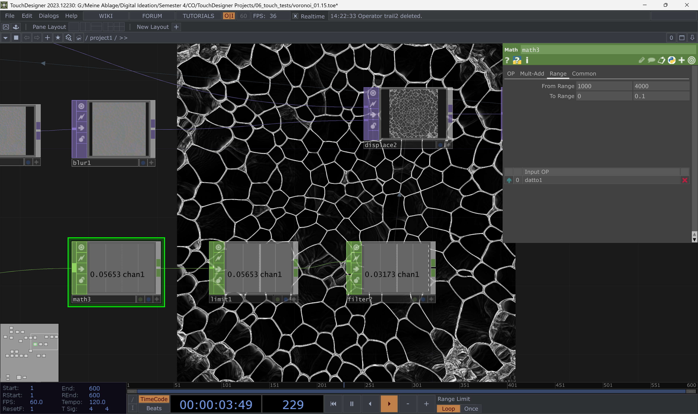


### 5.2.8. Beamer Setup
We wanted to test different lighting setups. We thought that the large beamer might overshadow our physical interaction point. We needed to balance this and perhaps provide some lighting for the interaction point itself. We also considered projecting our visual directly onto the interaction point. However, we preferred not to have any shadows on our beamer visuals and wanted them to remain clearly visible. This could be challenging if the visuals were projected onto the physical strings. To avoid the beamer shining directly into visitors' eyes, we tried to use indirect light from the beamer onto the strings. If we could balance the lighting, we envisioned having the visuals on a mobile wall—probably made of fabric—with the beamer on one side and the visitors and interaction point on the other.

``` markdown
Interactionpoint    |   Fabic Wall    |   Beamer
```

So we tested the beamer on fabric.


This worked pretty well!

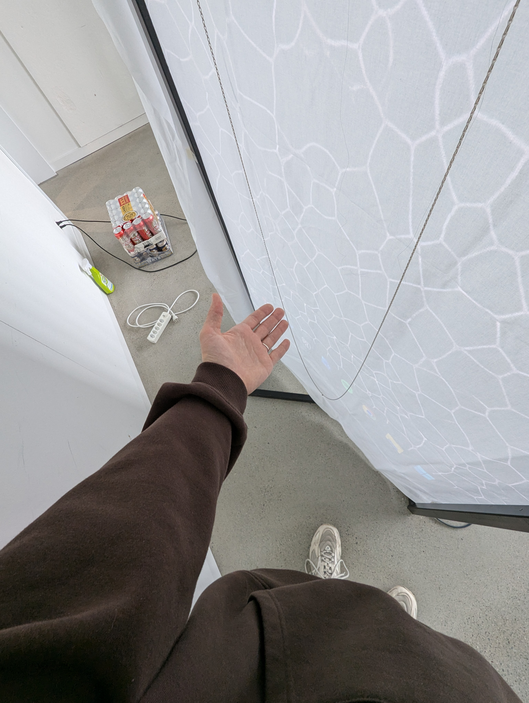

The main problem was that no light passed through the fabric. This made the purpose of projecting the beamer onto the strings invalid. However, we still needed to test different fabrics, and the smaller frame could still be useful later.

We further experimented with different fabrics and densities.


We couldn't find a good balance and think it's almost impossible to have the light shine through without blinding the visitors or losing the visuals on the fabric. Even a very thin fabric let almost no light through, and it was uncomfortable to look at because of the strong light.

## 5.3. Production

### 5.3.1. Wooden Branch
First, we created the tin drops. We melted some tin and poured it into cold water to form drops. We then had to drill a hole into each drop to attach them to a string. Initially, we had some difficulties finding enough tin and drilling the holes, but after some searching and trial and error, it worked as intended.

Later, we arranged for someone from the "Hausdienst" to help hang the branch from the ceiling. We suspended it using nylon strings, one on each side and one in the middle. Afterwards, we added the strings with the tin drops.

Unfortunately, the connection between the strings didn’t work properly at first. After a few unsuccessful attempts, we added another string running horizontally along the branch, connecting the hanging strings with the tin drops.

To connect it to the Arduino, we added another conductive string. We knotted it to the horizontal connection string, led it upwards along the nylon string towards the ceiling, and then taped it to the wall. From there, we routed the string down to the ground, where the Arduino was located.

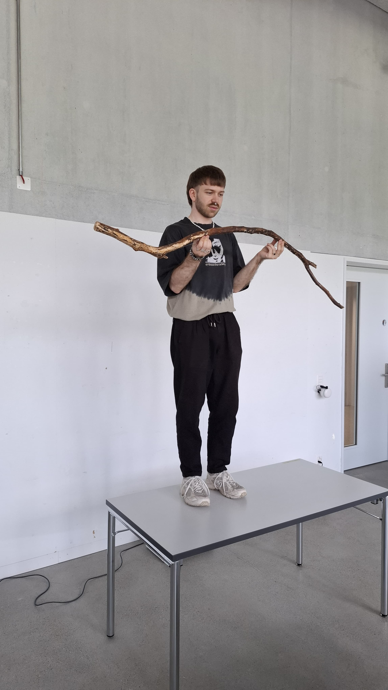

### 5.3.2. Hardware
We had most of our important hardware from prototyping. The most essential items were the beamer, the Arduino, and a PC to run TouchDesigner. To avoid using one of our laptops for the festival, we borrowed a desktop PC from the MediaDock.

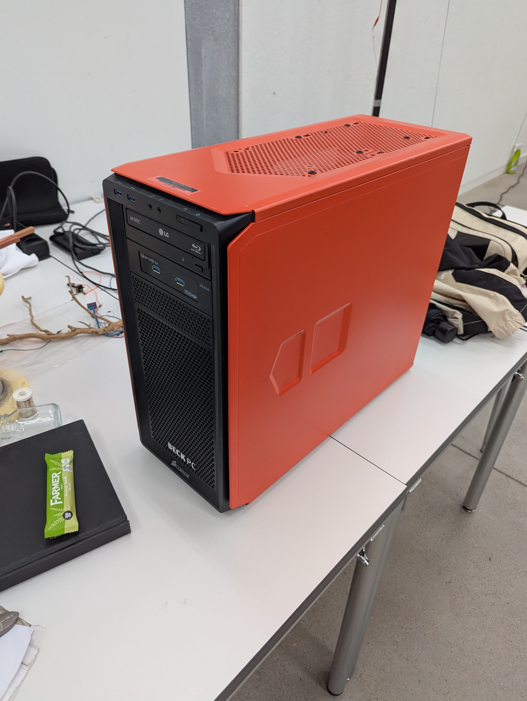

Unfortunately, this PC did not have a built-in WLAN receiver, and we couldn’t get hold of an external one. So, we borrowed a Mac Mini M1 from the Media Dock.

### 5.3.3. Visuals
Since we already had some visuals, the main task was connecting them and controlling them with the Arduino.

We have three different visuals for three states: the beginning, just before reaching the goal, and when the goal is reached. Two "Cross" TOPs were used to blend between the visuals.

Because we had a value from 0 to 1 for the blending, we had to split that into 0 – 0.5 and 0.5 – 1. These values then had to be remapped to 0 – 1 to work with the Cross TOP.

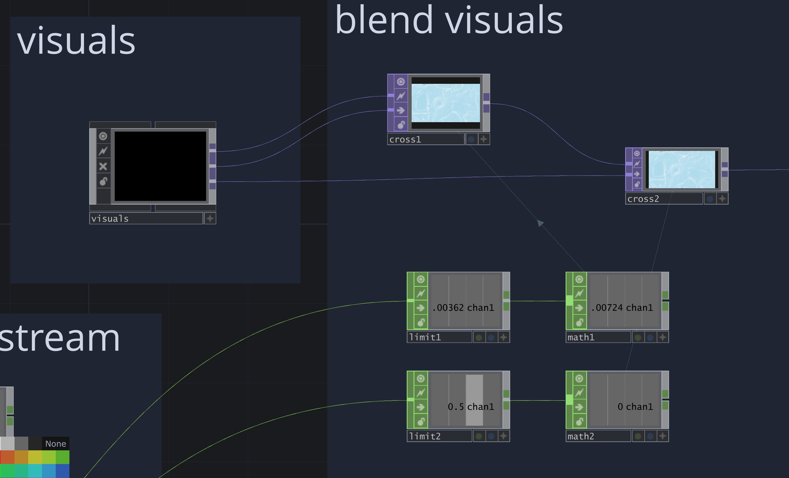

To control the Cross TOP with Arduino, we took the value stream, set limits for "no touch" and "goal is reached", remapped the values from 0 – 1, and added a filter to smooth out the stream and avoid abrupt jumps.

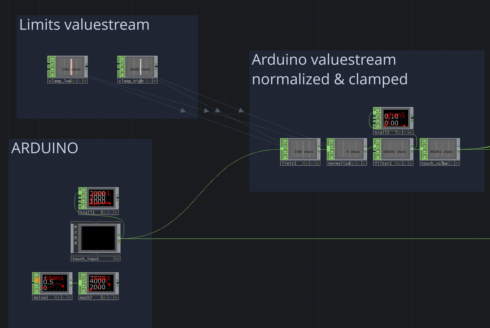

### 5.3.4. Interaction
To make the interaction more understandable and responsive, we added features to make it more reactive to touch and release. This way, visitors knew their touch was recognized. We wanted to add the following:
- Quick visual effect
- Small sound effect
- Touch indicator, to show how much energy is currently in the system

For the final exhibition, we only included the visual effect.

#### 5.3.4.1. Visual Effect
The visual effect is split into three parts: the trigger, the effect player, and the effect itself. The trigger uses a variable with a measured delay of 0.3 seconds and a threshold of 2000. It compares the current value with the value 0.3 seconds ago; if there is a change of more than 2000, a trigger signal is sent to the effect player. This consists of a timer, a duration, and logic to prevent the player from triggering again while it is running. While running, it outputs a fraction between 0 and 1. The effect contains three circles that grow larger, using the fraction as the radius with an offset of 0.2 so they follow each other. The circles are then used for a displacement effect.

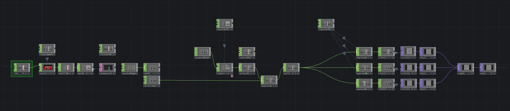

#### 5.3.4.2. Touch Indicator
First, we just added a text display from 0 to 1 to indicate the touch. We simply took the normalized value stream from the Arduino, added a lag update every 0.5 seconds, and rounded the values to every 0.1. In the text operator, we used the following expression to ensure only three characters of the value are displayed, and added a string to show the goal:

```
f"{str(op('touch_value_rounded')[0])[:3]} / 1"
```

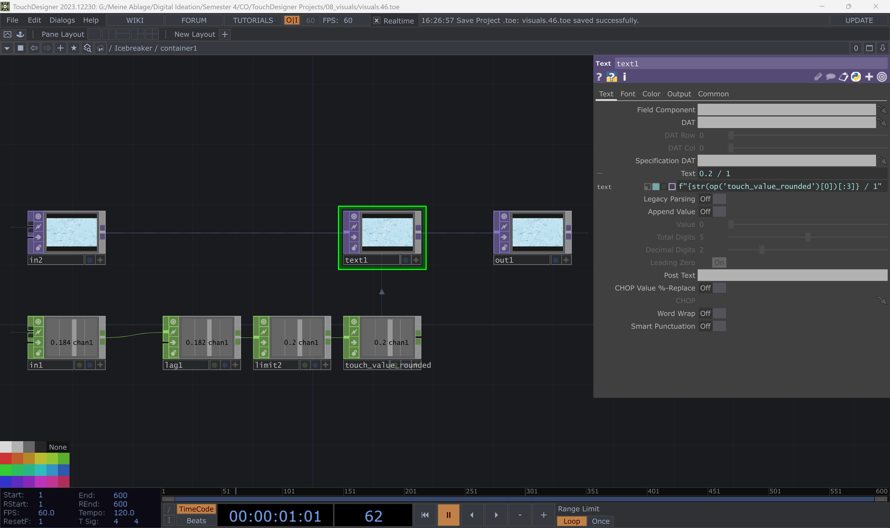

### 5.3.5. Audio
For the audio, we created two setups: One for the ambience and one for additional effects. Both are set up in the same way. We selected audio clips from the library [sonniss.com](https://sonniss.com/). We edited the clips in Adobe Audition to make them loopable and normalised them to the same volume level. In total, we used 11 audio clips: 4 for ambience and 7 for effects. 

In TouchDesigner, we included the clips and controlled the volume of each one based on the state of the touch input.

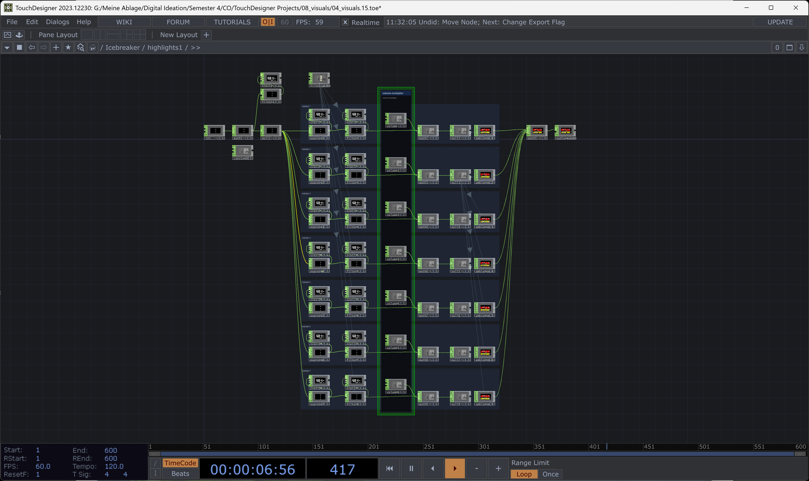

### 5.3.6. Text description
To encourage visitors to touch the wire and give them a hint to ask others for help, we created a small sign as a description of the installation. We didn’t want a long explanation, just something as short as possible, yet catchy and clear.


### 5.3.7. Final Setup
For the festival, we used the Mac Mini to run TouchDesigner, and a beamer to display the visuals. We had six headsets connected via two audio splitters for the sound, and used an Arduino to connect TouchDesigner with our branch installation. The branch was hung from the ceiling. It has multiple conductive strings attached, each with tin drops. We also used two spotlights to illuminate the branch and placed a sign with the descriptive notice nearby.

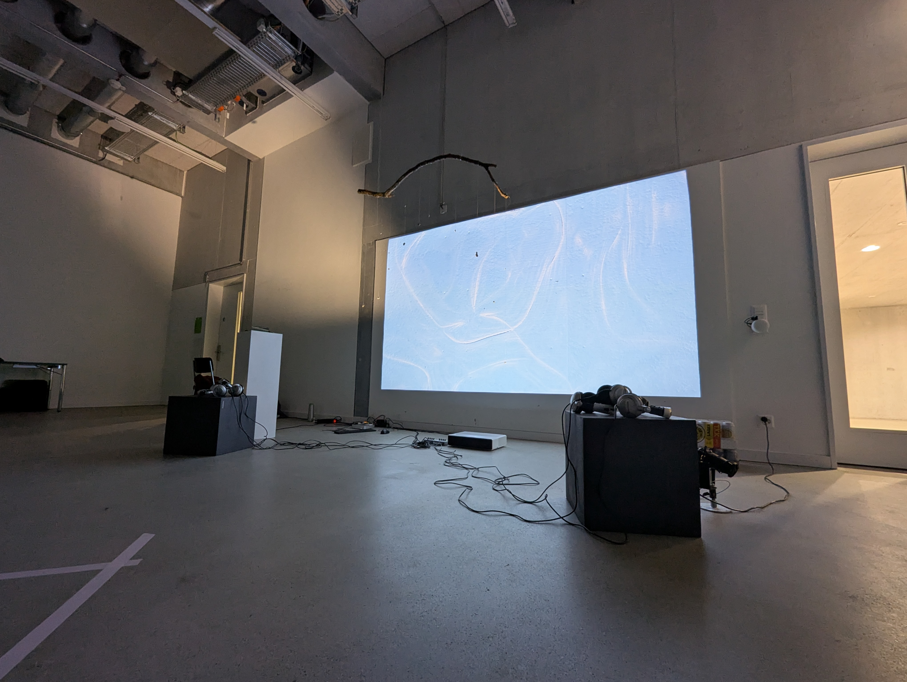 


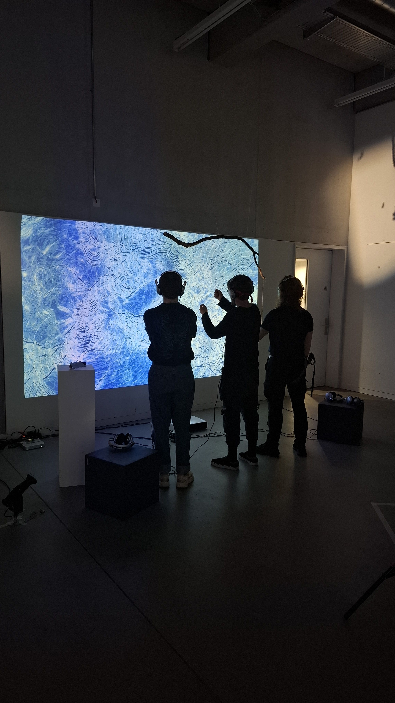

### 5.3.8. Final Program Files
- [Arduino](https://github.com/JanSchwegler/di-CO_128/blob/cf4eb02a5976f424e078538fe8e7fcae79e6db17/_abgabe_files/arduino/arduino.ino)
- [TouchDesigner](https://github.com/JanSchwegler/di-CO_128/blob/main/_abgabe_files/touchdesigner.toe)

## 5.4. Item List

| Nr  | Item                                         | Source                              | State           |
| --- | -------------------------------------------- | ----------------------------------- | --------------- |
| 1   | Conductive Fabric                            | DI CO "Spielst du mit?"             | ✅ Zurückgegeben |
| 1   | Conductive Thred                             | DI CO "Spielst du mit?"             | ✅ Zurückgegeben |
| 2   | Hardware intoduction Arduino                 | Thomas / Media Dock                 | ✅ Zurückgegeben |
| 3   | Arduino, Board, Resistor, USB Kabel          | Thomas / Media Dock                 | ▶️ Ausgeliehen   |
| 4   | PC Beck                                      | Media Dock offiziell duch Ausleihe  | ✅ Zurückgegeben |
| 5   | 2x Steckerleisten (Hausdienst, Schwarz)      | DI Raum 4. Stock                    | ✅ Zurückgegeben |
| 6   | Monitor (DIV57) inkl. Strom- und HDMI-Kabel  | DI Raum Erdgeschoss durch Guillaume | ✅ Zurückgegeben |
| 7   | Tastatur (DI7654)                            | DI Raum Erdgeschoss durch Guillaume | ✅ Zurückgegeben |
| 8   | Beamer                                       | Ausleihe offiziell                  | ✅ Zurückgegeben |
| 9   | HDMI Kabel für Beamer                        | Ausleihe offiziell                  | ✅ Zurückgegeben |
| 10  | Grünes LAN Kabel                             | Media Dock                          | ✅ Zurückgegeben |
| 11  | PC Stromkabel                                | Ausleihe (inoffiziell)              | ✅ Zurückgegeben |
| 12  | 8 Kopfhörer (inkl. Adapter auf 3.5mm Klinke) | Ausleihe                            | ✅ Zurückgegeben |
| 13  | 2 Audio Splitter                             | Ausleihe                            | ✅ Zurückgegeben |
| 14  | MAC Mini M1 (soat2022)                       | Thomas / Media Dock                 | ▶️ Ausgeliehen   |
| 15  | 2 Lampen                                     | Ausleihe                            | ✅ Zurückgegeben |

## 5.5. Presentation
The presentation went smoothly. People were fascinated by how the installation worked, especially since no cables or wiring were visible. The project structure in TouchDesigner also received positive feedback.

The main critique was that the threads were still too delicate and not inviting enough to touch.

People enjoyed taking off their shoes and triggering the maximum values in the visual.

Overall, the project was very well received.

## 5.6. Reflection
We really enjoyed the module, its possibilities, and the many things we learned. Along the way, there were some challenges. 

The organisation had its ups and downs, sometimes the expectations and plans weren’t very clear. Our team had some issues with the communication via Teams. As we often saw messages a few days late. Additionally, some information about the hubs and the festival came a bit late. In the final week of the module, there was very little communication between the groups. Some wrapup's to plan the space, ideas, sound and headphones could have been helpful.

The interest-oriented teambuilding was great, though it was a bit difficult, since we didn’t have specific ideas at the beginning. The teamwork and mentoring worked very well for us. We personally preferred not having fixed time slots and instead appreciated the flexibil talks when needed throughout the day. We really enjoyed the unlimited possibilities of the project, the long introduction to TouchDesigner gave us a strong foundation, but we also appreciated not being tied to a specific technique. We felt that many of our discussions and mentoring sessions were focused on conceptual aspects. We would have preferred to experiment and explore more the technical possibilities.

We’re very happy and proud of our installation. We were fascinated by the almost invisible connection and how everything came together in the end. It was great to see how magical it felt for the visitors. Their reactions and questions showed genuine curiosity. We’re also pleased with the overall aesthetic, especially the colours and how well everything worked together, given the limited time we had at the end to set up the branch, headphones, and lighting.

The installation itself wasn’t always clear to visitors, so there’s definitely room to improve. Also, how the concept is communicated. Still, people responded very positively to the audio element. It was a joy to watch them experiment with the installation and wonder how it worked. Most of the time, several people at once interacted with the installation, which fit perfectly with our aim of collective input. But on the other hand, not a lot of people were asking strangers for help.

All in all, we had a very positive experience with this module. We learned a lot about TouchDesigner and interactive possibilities. We’re grateful for the help, the engagement, and the freedom we had throughout. We always received help when needed, with a genuine intention to support and improve our work.

We’re proud of our installation and what we achieved.